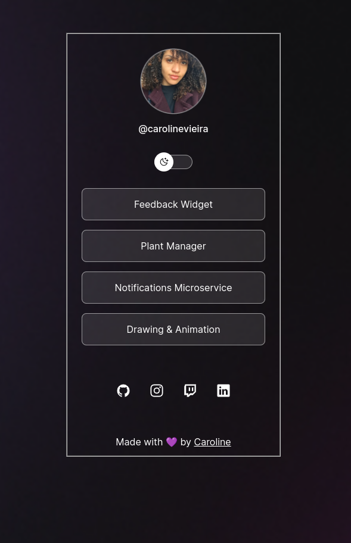
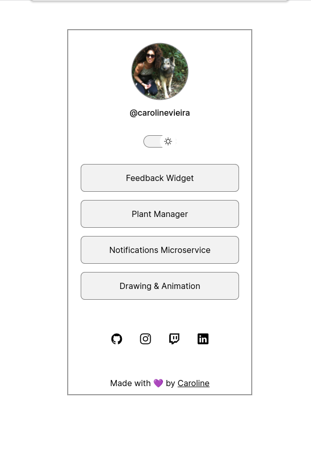

<p align="center" id="top">
    
</p>

<p align="center">
  <a href="#rocket-tecnologias">Tecnologias</a>&nbsp;&nbsp;&nbsp;|&nbsp;&nbsp;&nbsp;
  <a href="#-projeto">Projeto</a>&nbsp;&nbsp;&nbsp;|&nbsp;&nbsp;&nbsp;
  <a href="#-layout">Layout</a>&nbsp;&nbsp;&nbsp;|&nbsp;&nbsp;&nbsp;
</p>
<br>

<p align="center">
	 
    
</p>

<br>


Take a peek: https://ca-byte.github.io/devlinks/

---
<br>

## 🚀 Technologies ##

This project was developed using the following technologies:

- [HTML](https://developer.mozilla.org/en-US/docs/Web/HTML)
- [CSS](https://developer.mozilla.org/en-US/docs/Web/CSS)
- [Javascript](https://developer.mozilla.org/en-US/docs/Web/JavaScript)

<br>

---
## ⌨ How to run the project ##

```bash
# Clone this project
$ git clone git@github.com:Ca-byte/devlinks.git

# Access
$ cd dev-links

# Opening your live server you can drag your index.html and drop it in your browser or keyboard shortcut[Alt + l Alt + O].

```
<br>

---

## 💻 Project

The project idea is basically to introduce the basics of the web tools as HTML, CSS, Javascript creating a profile with project and social links in light and dark mode.

This is a project is available on **[Dev Links](https://app.rocketseat.com.br/devlinks/)**, run by **[@Rocketseat](https://github.com/Rocketseat)**. Give pi

<br>

---

## 🔖 Layout ##

- [Dev Links](https://www.figma.com/file/HXygS0vgB1qWI4P5wH9FIQ/DevLinks-(Community)?node-id=1%3A113&t=eGcKYLMaVl1uwVA4-0)

Remembering that you need to have a [Figma](http://figma.com/) account to access it.

---

<br>
<p align="center">Developed with 💜 by Caroline Vieira</p>

<a href="#top">☝</a>

